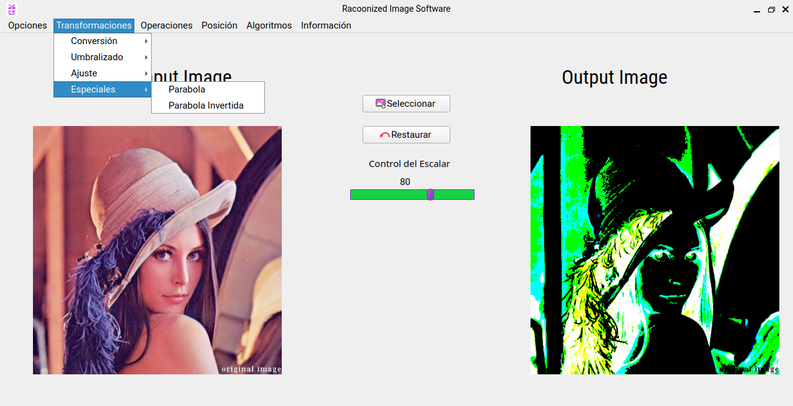

# App de Procesamiento de Imágenes en C++ y qt5-
Este proyecto es un prototipo de aplicación en C++ con interfaz Qt. 
Aplica transformaciones, muestra información relevante y opera filtros en el Bitmap para comprender los fundamentos de Visión por Computadora y Procesamiento Dígital de Imágenes. 

